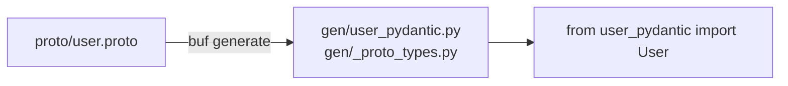

---

<div align="center" markdown>

{ width="280" }

# protoc-gen-pydantic

Define your data schema once in Protobuf. Get validated, type-safe Python models automatically.

[Get Started](guide/quickstart.md){ .md-button .md-button--primary }
[View on GitHub](https://github.com/cjermain/protoc-gen-pydantic){ .md-button }

</div>

---

If you work with Protobuf APIs in Python, you face a familiar tradeoff: use the raw `_pb2`
classes — no validation, no editor support — or hand-write parallel Pydantic models and keep
them in sync forever. protoc-gen-pydantic generates Pydantic v2 models directly from your
`.proto` files, so your schema stays the single source of truth.

## How it works

`protoc-gen-pydantic` is a `protoc` plugin written in Go. You run `buf generate` (or `protoc`)
once, and the plugin reads your `.proto` files and writes ready-to-use Python files alongside
them. After that, code generation is the only step — no runtime dependency on the plugin itself.



Every generated message class inherits from `_ProtoModel`, a thin base class that adds
ProtoJSON-aware serialization helpers on top of standard Pydantic. See
[Generated Model API](features/generated-model-api.md) for the full interface.

## Basic usage

A single `buf generate` command turns any `.proto` file into a ready-to-use Pydantic model:

=== ":lucide-file-code: item.proto"

    ```proto
    syntax = "proto3";

    package example;

    message Item {
      string name = 1;
      int32 quantity = 2;
      double price = 3;
    }
    ```

=== ":simple-python: item_pydantic.py (generated)"

    ```python
    from pydantic import Field as _Field


    class Item(_ProtoModel):
        name: "str" = _Field("")
        quantity: "int" = _Field(0)
        price: "float" = _Field(0.0)
    ```

The generated model validates inputs immediately — no extra setup, no runtime surprises.

## With validation constraints

Add `buf.validate` constraints to your proto fields, and the generator translates them
directly into Pydantic validation:

=== ":lucide-file-code: user.proto"

    ```proto
    syntax = "proto3";

    package example;

    import "buf/validate/validate.proto";

    // A user account.
    message User {
      // Display name (1–50 characters).
      string name = 1 [
        (buf.validate.field).string.min_len = 1,
        (buf.validate.field).string.max_len = 50
      ];

      // Age in years.
      int32 age = 2 [(buf.validate.field).int32.gte = 0];

      // Contact email address.
      string email = 3 [(buf.validate.field).string.email = true];

      enum Role {
        ROLE_UNSPECIFIED = 0;
        ROLE_VIEWER = 1;
        ROLE_EDITOR = 2;
        ROLE_ADMIN = 3;
      }

      Role role = 4;
    }
    ```

=== ":simple-python: user_pydantic.py (generated)"

    ```python
    from enum import Enum as _Enum
    from typing import Annotated as _Annotated

    from pydantic import (
        AfterValidator as _AfterValidator,
        Field as _Field,
    )

    from ._proto_types import _validate_email


    class User(_ProtoModel):
        """A user account."""

        class Role(str, _Enum):
            UNSPECIFIED = "UNSPECIFIED"
            VIEWER = "VIEWER"
            EDITOR = "EDITOR"
            ADMIN = "ADMIN"

        # Display name (1–50 characters).
        name: "str" = _Field(
            "",
            min_length=1,
            max_length=50,
            description="Display name (1–50 characters).",
        )

        # Age in years.
        age: "int" = _Field(0, ge=0, description="Age in years.")

        # Contact email address.
        email: "_Annotated[str, _AfterValidator(_validate_email)]" = _Field(
            "",
            description="Contact email address.",
        )

        role: "User.Role | None" = _Field(None)
    ```

=== ":simple-python: usage.py"

    ```python
    from user_pydantic import User

    # Construct and validate
    user = User(name="Alice", age=30, email="alice@example.com", role=User.Role.EDITOR)

    # Serialize (ProtoJSON — omits zero values, uses original proto field names)
    print(user.to_proto_json())
    # {"name": "Alice", "age": 30, "email": "alice@example.com", "role": "EDITOR"}

    # Validation errors are raised immediately
    User(name="", age=-1)  # ValidationError: name too short, age below 0
    ```

[Get started →](guide/quickstart.md){ .md-button .md-button--primary }
