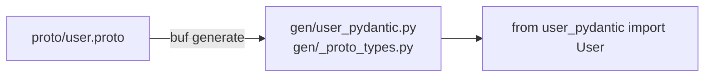

---

<div align="center" markdown>

{ width="280" }

# protoc-gen-pydantic

Define your data schema once in Protobuf. Get validated, type-safe Python models automatically.

[Get Started](guide/quickstart.md){ .md-button .md-button--primary }
[View on GitHub](https://github.com/cjermain/protoc-gen-pydantic){ .md-button }

</div>

---

If you work with Protobuf APIs in Python, you face a familiar tradeoff: use the raw `_pb2`
classes — no validation, no editor support — or hand-write parallel Pydantic models and keep
them in sync forever. protoc-gen-pydantic generates Pydantic v2 models directly from your
`.proto` files, so your schema stays the single source of truth.

## How it works

`protoc-gen-pydantic` is a `protoc` plugin written in Go. You run `buf generate` (or `protoc`)
once, and the plugin reads your `.proto` files and writes ready-to-use Python files alongside
them. After that, code generation is the only step — no runtime dependency on the plugin itself.


```mermaid
flowchart LR
    A["proto/user.proto"] -->|buf generate| B["gen/user_pydantic.py<br/>gen/_proto_types.py"]
    B --> C["from user_pydantic import User"]
```

Every generated message class inherits from `_ProtoModel`, a thin base class that adds
ProtoJSON-aware serialization helpers on top of standard Pydantic. See
[Generated Model API](features/generated-model-api.md) for the full interface.

```python exec="on" session="index"
import inspect
import os
import sys

sys.path.insert(0, os.path.join(os.environ["MKDOCS_CONFIG_DIR"], "test", "gen"))

from api.v1.field_types_pydantic import Item
from api.v1.validate_pydantic import ValidatedUser
```

## Basic usage

A single `buf generate` command turns any `.proto` file into a ready-to-use Pydantic model:

=== ":lucide-file-code: item.proto"

    ```proto
    syntax = "proto3";

    package example;

    message Item {
      string name     = 1;
      int32  quantity = 2;
      double price    = 3;
    }
    ```

=== ":simple-python: item_pydantic.py (generated)"

    ```python exec="on" session="index"
    print(f"```python\n{inspect.getsource(Item).rstrip()}\n```")
    ```

The generated model validates inputs immediately — no extra setup, no runtime surprises.

## With validation constraints

Add `buf.validate` constraints to your proto fields, and the generator translates them
directly into Pydantic validation:

=== ":lucide-file-code: user.proto"

    ```proto
    syntax = "proto3";

    package example;

    import "buf/validate/validate.proto";

    // A user account.
    message ValidatedUser {
      // Display name (1–50 characters).
      string name = 1 [
        (buf.validate.field).string.min_len = 1,
        (buf.validate.field).string.max_len = 50
      ];

      // Age in years.
      int32 age = 2 [(buf.validate.field).int32.gte = 0];

      // Contact email address.
      string email = 3 [(buf.validate.field).string.email = true];

      enum Role {
        ROLE_UNSPECIFIED = 0;
        ROLE_VIEWER = 1;
        ROLE_EDITOR = 2;
        ROLE_ADMIN = 3;
      }

      Role role = 4;
    }
    ```

=== ":simple-python: user_pydantic.py (generated)"

    ```python exec="on" session="index"
    print(f"```python\n{inspect.getsource(ValidatedUser).rstrip()}\n```")
    ```

```python exec="on" session="index"
from pydantic import ValidationError

user = ValidatedUser(
    name="Alice", age=30, email="alice@example.com", role=ValidatedUser.Role.EDITOR
)
proto_json = user.to_proto_json()

try:
    ValidatedUser(name="", age=-1)
except ValidationError as e:
    n = e.error_count()
```

The generated model is immediately usable — construct, serialize, and validate with standard
Pydantic:

```python exec="on" session="index"
code = (
    "from user_pydantic import ValidatedUser\n"
    "\n"
    "# Construct and validate\n"
    'user = ValidatedUser(name="Alice", age=30, email="alice@example.com", role=ValidatedUser.Role.EDITOR)\n'
    "\n"
    "# Serialize (ProtoJSON — omits zero values, uses original proto field names)\n"
    "print(user.to_proto_json())\n"
    f"# {proto_json}\n"
    "\n"
    "# Validation errors are raised immediately\n"
    f'ValidatedUser(name="", age=-1)  # raises ValidationError ({n} validation errors)'
)
print(f"```python\n{code}\n```")
```

```python exec="on" session="index"
assert (
    proto_json
    == '{"name":"Alice","age":30,"email":"alice@example.com","role":"EDITOR"}'
)
assert n == 2
```

[Get started →](guide/quickstart.md){ .md-button .md-button--primary }

---

## Acknowledgements

This project is a fork of [ornew/protoc-gen-pydantic](https://github.com/ornew/protoc-gen-pydantic)
by [Arata Furukawa](https://github.com/ornew), which provided the initial plugin structure and
plugin options. This fork adds well-known type mappings, Python builtin/keyword alias handling,
cross-package references, enum value options, ProtoJSON-compatible output, buf.validate
constraint translation, conditional imports, and a full test suite.
